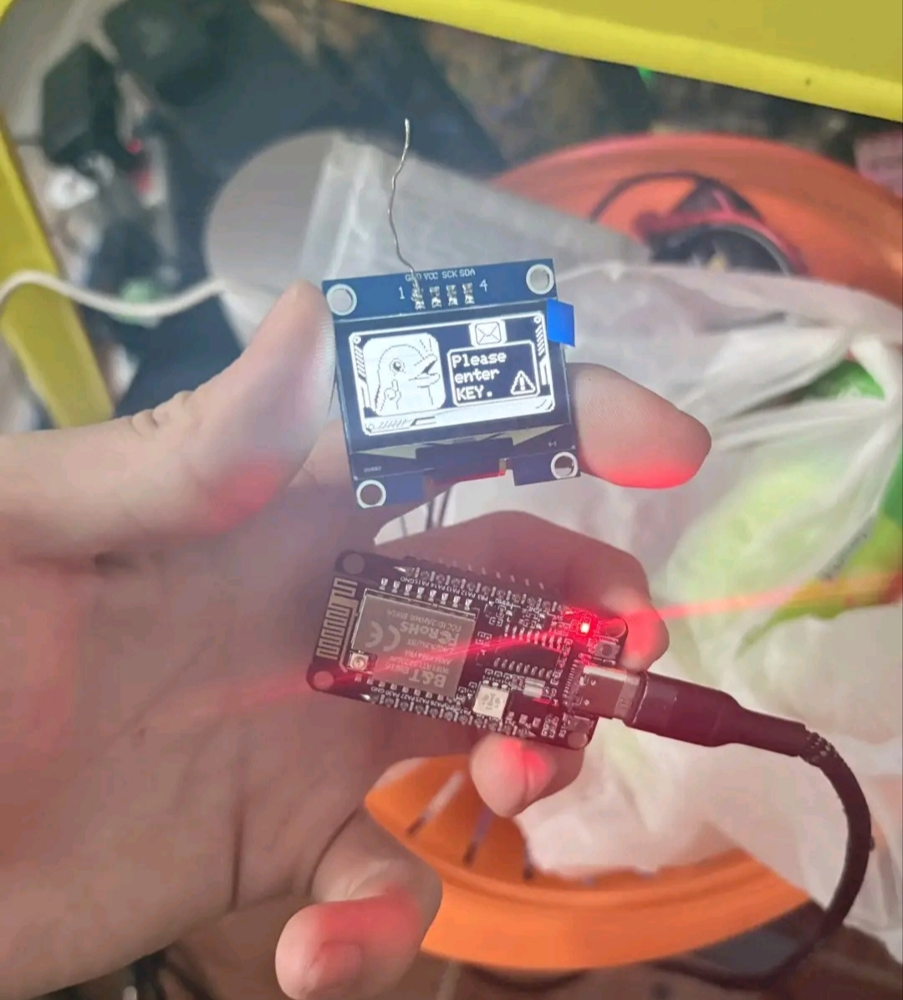
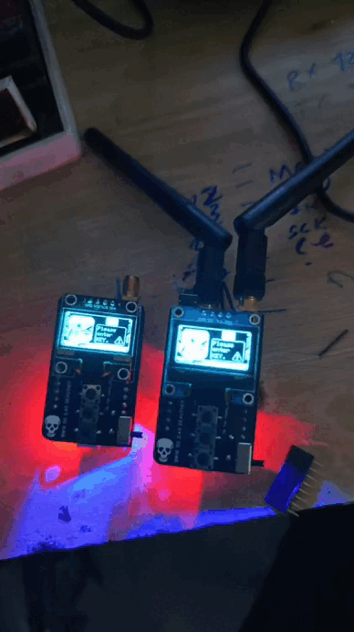
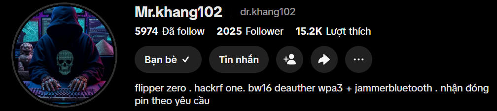

# 📡 Deauther WiFi 5GHz - Code Tiếng Việt

Dự án sử dụng module BW16 để thực hiện các kỹ thuật kiểm thử bảo mật mạng WiFi băng tần 5GHz.

## 📺 Hướng dẫn nạp Code
Anh em xem cách nạp file `.bin` chi tiết cho module BW16 tại kênh bác **Nam Nobi** nhé:
👉 [Xem video hướng dẫn tại đây](https://youtu.be/q96H-Iu4dWs?si=2UGkc-Wj9JI2bgHl)

---

## 🛠 Sơ đồ đấu nối (Schematic)

Dưới đây là sơ đồ kết nối chân giữa BW16 và các module ngoại vi:

| v2 | v3.6 trở đi | v4.3 trở đi |
| :---: | :---: | :---: |
|  |  |  |

### 🎞 Video Review PCB

https://github.com/uchiha-madara-02/DEAUTHER-5GHZ/blob/main/PCB/478689208-403d96ce-08eb-45dd-99b3-8ad3d730bd37.mp4

---

## ⚠️ Anh em lưu ý, bản v4.3 trở đi sẽ cần có key mới hoạt động được nhé!

### Nếu anh em không có key nó sẽ hiện như này:

 |  

### Anh em mua key thì liên hệ:
> ### 💰 Giá: 40k / 1 key
> **Lưu ý:** Key được định danh, chỉ dùng được duy nhất cho **1 thiết bị BW16**.
### 🎥 Ghé thăm kênh TikTok của chúng mình:
*👉 Nhấn vào hình ảnh để xem chi tiết:*

| Uchiha Madara | Mr.khang102 |
| :---: | :---: |
|  |  |

---

### 🎥 Video Demo sản phẩm:

### 🎥 Video Demo

---

## ⚠️ Lưu ý quan trọng (Lưu ý kỹ trước khi dùng)

* **Chế độ hoạt động:** Khi vừa khởi động, mạch sẽ chạy biểu cảm "Dasai Clone". Để vào chế độ tấn công, bạn cần **nhấn giữ nút OK trong 3 giây**.
* **Thoát chế độ:** Để thoát ra ngoài, tiếp tục **nhấn giữ nút OK trong 3 giây**.
* **Về tính năng đo Pin:** * Nếu anh em **không lắp mạch đo pin**, tuyệt đối không nạp bản có code đo pin.
    * Lý do: Khi pin yếu hoặc không có tín hiệu pin, code sẽ tự động dừng toàn bộ chương trình để bảo vệ hệ thống, khiến mạch bị treo.

---
*Chúc anh em vọc vạch vui vẻ! Nếu thấy hay hãy cho dự án 1 Star nhé.*
